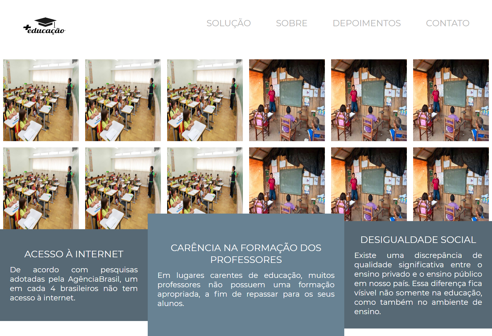

<h1 style="text-align: center; font-weight: bold;">+Educação</h1>

## Demonstração 📸

  

---

## Sobre o Projeto

Projeto realizado para concluir o desafio da Rocketseat.  "Pensando em construir o futuro, como você solucionaria os problemas de acesso à educação hoje, utilizando a tecnologia?"

Link do projeto: https://mais-educacao.vercel.app/

### 🛠 Tecnologias

As seguintes ferramentas foram usadas na construção do projeto:

- [HTML5]
- [CSS3]
- [Javascript]
- [jQuery]

---

 

Veja meu Linkedin: [LEANDRO ARAÚJO](http://www.linkedin.com/in/leandro-ara%C3%BAjo-da-silva-1660631b9)
